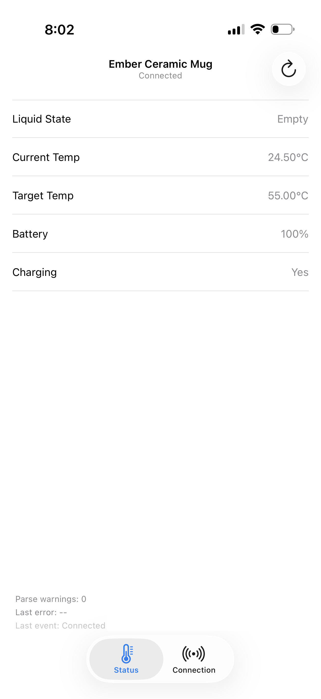

# Ember Status (Read-Only)

Read-only Ember mug status client with a reusable core library (`EmberCore`) and a UIKit app (`Apps/EmberStatusApp`) for iOS + Mac Catalyst.

Minimum platform targets:
- iOS 26.0
- macOS 26.0 (via Mac Catalyst and SwiftPM platform support)

## Screenshot



## Current Repo State

### Core package (`EmberCore`)
- Domain models for mug identity, status, and diagnostics.
- Defensive protocol parsers for read-only payload decoding.
- Event-driven reducer for partial status updates.
- Bluetooth abstractions and CoreBluetooth implementation for scan/connect/read/notify.
- `MugSessionCoordinator` for session orchestration (scan ranking, connect/disconnect, refresh, capability discovery, listener lifecycle, reconnect behavior).

### App (`Apps/EmberStatusApp`)
- UIKit-only app.
- iOS tab UI with `Status` and `Connection`.
- Mac Catalyst split UI with sidebar navigation between `Status` and `Connection`.
- Status screen uses nav-title mug/connection display, a continuous telemetry table, and a bottom diagnostics strip.
- Connection screen uses a continuous details table, auto-connect switch row, and standard nav bar actions (`Scan`, `Connect`, `Disconnect`).
- Shared app session store wires coordinator snapshots into UI state and persists preferred auto-connect settings.

### Tests
- Unit and integration tests cover status parsing, reducer behavior/display state, read-only guardrails, and session coordinator workflows.

## Repository Layout

- `Sources/EmberCore/Domain` — core models
- `Sources/EmberCore/Protocol` — status parsing
- `Sources/EmberCore/State` — reducer/state updates
- `Sources/EmberCore/Bluetooth` — BLE abstractions + CoreBluetooth manager
- `Sources/EmberCore/UseCases` — `MugSessionCoordinator`
- `Sources/EmberCore/Diagnostics` — diagnostics + connection event metadata
- `Apps/EmberStatusApp` — UIKit iOS/Mac Catalyst app target
- `Tests/EmberCoreTests` — unit + integration tests

## Validate

Run package tests:

```bash
swift test
```

Build the app target:

```bash
xcodebuild -project Apps/EmberStatusApp/EmberStatusApp.xcodeproj -scheme EmberStatusApp -configuration Debug -destination 'platform=iOS Simulator,name=iPhone 17' build
```
